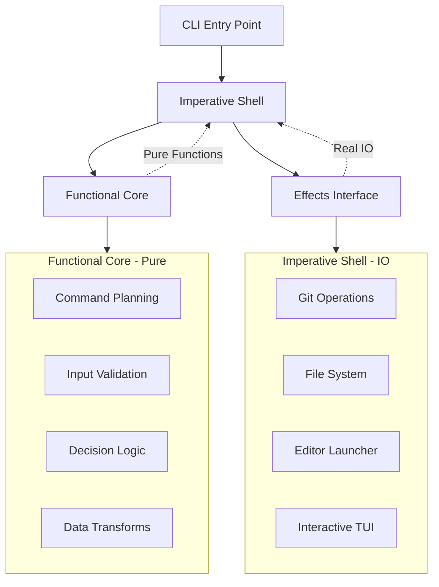

# Functional Programming Refactor Plan

## Architecture Vision




## Phase 1: Foundation - Extract Pure Functions (Week 1)

### Step 1.1: Create test infrastructure ✅

- ✅ Created [`internal/core/core_test.go`](internal/core/core_test.go) with basic test setup
- ✅ Using `testify/assert` (industry standard, not custom helpers)
- ✅ Added factory helpers: `MakeBranch`, `MakeWorktree`
- ✅ Tests passing: `go test ./internal/core/...`

**Decisions made:**

- Switched from custom helpers to `testify/assert` for better standardization
- Kept only factory functions, removed 70+ lines of custom assertion code

### Step 1.2: Extract git command building logic ✅

- ✅ Created [`internal/core/git_commands.go`](internal/core/git_commands.go)
- ✅ Extracted `WorktreeAddArgs` as pure function (from [`cmd/add.go`](cmd/add.go) lines 203-239)
- ✅ Wrote 8 comprehensive test cases covering all branch scenarios
- ✅ Updated [`cmd/add.go`](cmd/add.go) to use the pure function
- ✅ Tests passing, code compiles

**Decisions made:**

- ~~Used placeholder `<path>` in function for better testability~~
- ~~Caller replaces placeholder with actual path (keeps function pure)~~
- Path is now a regular parameter (still pure, no magic needed)
- Reduced add.go from 37 lines of logic to ~15 lines using the pure function
- Named function `WorktreeAddArgs` (not `BuildWorktreeAddCommand`) - shorter, more idiomatic
- Kept return type as `[]string` rather than custom type - more idiomatic Go
- Fixed `--no-track` semantics: only for truly new branches, NOT for remote tracking branches
- Remote branches now correctly enable upstream tracking (critical for `git push`)
- Fixed `--no-track` placement: must come AFTER `-b` (Git parsing requirement)
- Explicit `HEAD` argument for consistency
- Added remote prefix stripping in command handler (`origin/feature` → `feature`)
- Tests now verify argument ordering, not just presence (catches Git CLI bugs)
- Added `t.Parallel()` for faster test execution

**Key learnings:**

- Pure functions are easier to test, but domain knowledge (Git semantics) is still critical
- Code review caught bugs that tests alone wouldn't reveal (argument ordering)
- FP doesn't mean fewer parameters - it means deterministic behavior
- Go prefers concise doc comments over structured JavaDoc-style
- Guard clauses (early returns) are more readable than nested if/else

### Step 1.3: Extract branch filtering logic ✅

- ✅ Created [`internal/core/branches.go`](internal/core/branches.go) with `GetWorktreeAvailableBranches`
- ✅ Extracted filtering logic from [`cmd/add.go`](cmd/add.go) lines 100-127
- ✅ Wrote 7 comprehensive test cases in [`internal/core/branches_test.go`](internal/core/branches_test.go)
- ✅ Updated [`cmd/add.go`](cmd/add.go) to use pure function
- ✅ Tests passing, code compiles

**Decisions made:**

- Named function `GetWorktreeAvailableBranches` (not `FilterAvailableBranches`) - clear domain context
- Function takes `worktrees []git.Worktree` directly (not pre-built map) - better encapsulation
- Added canonical `Branch.Name` field for robust comparison with `Worktree.Branch`
- Fixed upstream bug: filter "origin" remote name in `git.ListAllBranches()` where parsing happens
- Used `map[string]struct{}` for set (idiomatic Go, not `map[string]bool`)
- Preallocated slices for performance
- Added defensive empty name check
- Documented detached HEAD policy (non-obvious business rule)

**Key learnings:**

- Fix data quality issues upstream (in parser), not downstream (in business logic)
- Canonical fields (`Name`) prevent string formatting fragility
- "Available" is vague - `GetWorktreeAvailableBranches` is clear
- Code reviews caught: separation of concerns issue, comparison key fragility, over-commenting
- Iterative refinement through code review improved from 44 lines to 28 lines of clean code

### Step 1.4: Extract worktree selection logic ✅

- ✅ Created [`internal/core/worktrees.go`](internal/core/worktrees.go) with `FilterSproutWorktrees`, `FindWorktreeByBranch`, and `IsPathUnderAnySproutRoot`
- ✅ Extracted filtering logic from [`cmd/open.go`](cmd/open.go), [`cmd/list.go`](cmd/list.go), and [`cmd/remove.go`](cmd/remove.go)
- ✅ Wrote 32 comprehensive test cases in [`internal/core/worktrees_test.go`](internal/core/worktrees_test.go)
- ✅ Updated [`cmd/open.go`](cmd/open.go), [`cmd/list.go`](cmd/list.go), and [`cmd/remove.go`](cmd/remove.go) to use pure functions
- ✅ Deleted obsolete [`cmd/worktrees.go`](cmd/worktrees.go) (all functions migrated)
- ✅ Tests passing, code compiles, no linter errors

**Decisions made:**

- Named `FilterSproutWorktrees` (not `FilterSproutWorktreesAllRoots`) - simpler, takes roots as parameter
- Named `FindWorktreeByBranch` - clear intent, returns `(path, found)` tuple
- Added `IsPathUnderAnySproutRoot` for validation logic in remove command
- All functions take `sproutRoots []string` as parameter for better testability
- Kept `isUnderSproutRoot` as internal helper (not exported)
- Returns `nil` for empty inputs (Go convention for empty results)
- Skips worktrees with empty paths defensively
- Preallocated result slices for performance
- Added parallel test execution with `t.Parallel()`

**Key learnings:**

- Passing dependencies as parameters (sproutRoots) makes functions more testable
- No need to call `sprout.GetAllPossibleSproutRoots()` inside pure functions - caller provides it
- Empty slice vs nil slice matters in Go assertions - be consistent
- Defensive checks (empty path, empty branch) prevent edge case bugs
- Helper function `isUnderSproutRoot` encapsulates filepath comparison logic cleanly
- Refactoring reveals opportunities for complete file deletion (old worktrees.go)

## Phase 2: Core Types - Define FP Infrastructure (Week 2)

### Step 2.1: Create Action types ✅

- ✅ Created [`internal/core/actions.go`](internal/core/actions.go) with core FP types
- ✅ Defined `ActionType` enum with 9 action types
- ✅ Created `Action` struct with flexible `Data map[string]any`
- ✅ Created `Plan` struct to hold action sequences
- ✅ Renamed `CheckTrust` to `TrustRepo` for clarity (trust is an action, not just a check)
- ✅ No linter errors, code compiles

**Decisions made:**

- Used `any` instead of `interface{}` (Go 1.18+ idiom)
- Kept `Data` as flexible map - avoids premature type proliferation
- Named `TrustRepo` not `CheckTrust` - actions modify state, checks don't
- Minimal implementation as specified - expand as needed

**Original plan reference:**

- Create [`internal/core/actions.go`](internal/core/actions.go):
  ```go
                                                    type ActionType int
                                                    const (
                                                        NoOp ActionType = iota
                                                        PrintMessage
                                                        PrintError
                                                        CreateDirectory
                                                        RunGitCommand
                                                        OpenEditor
                                                        RunHooks
                                                        CheckTrust
                                                        SelectInteractive
                                                    )
    
                                                    type Action struct {
                                                        Type ActionType
                                                        Data map[string]any // Use any for flexibility
                                                    }
    
                                                    type Plan struct {
                                                        Actions []Action
                                                    }
  ```


- Keep it minimal - we'll expand as needed

### Step 2.2: Create Effects interface ✅

- ✅ Created [`internal/effects/effects.go`](internal/effects/effects.go)
- ✅ Defined Effects interface with all side effect operations
- ✅ 7 categories: Git, FS, Config, Trust, Editor, Output, Interactive
- ✅ Fixed type safety: replaced `SelectOne(any, any)` with specific `SelectBranch`/`SelectWorktree` methods
- ✅ Renamed `CreateDir` → `MkdirAll` for clear "ensure exists" semantics
- ✅ Code compiles, no linter errors

**Decisions made:**

- Used specific selection methods (`SelectBranch`, `SelectWorktree`) instead of generics - Go doesn't allow generic interface methods
- Renamed to `MkdirAll` to match `os.MkdirAll` semantics (create parent dirs, idempotent)
- Kept single interface (not split) - will refactor if pain emerges (YAGNI)
- `FileExists` returns bool - CLI semantic: inaccessible = doesn't exist
- `IsTrusted` (check) vs `TrustRepo` (action) clearly separated

**Code review insights:**

- Type safety matters: `any` parameters cause runtime panics
- Name things honestly: `MkdirAll` vs `CreateDir` clarifies intent
- Don't split interfaces prematurely - test mocks can use anonymous structs
- Go limitation: no generic interface methods (only generic types)

**Original plan reference:**

- Create [`internal/effects/effects.go`](internal/effects/effects.go):
  ```go
                                                    type Effects interface {
                                                        // Git operations
                                                        GetRepoRoot() (string, error)
                                                        GetMainWorktreePath() (string, error)
                                                        ListWorktrees(repoRoot string) ([]git.Worktree, error)
                                                        ListBranches(repoRoot string) ([]git.Branch, error)
                                                        RunGitCommand(dir string, args ...string) (string, error)
    
                                                        // File system
                                                        FileExists(path string) bool
                                                        CreateDir(path string, perm os.FileMode) error
    
                                                        // Config
                                                        LoadConfig(currentPath, mainPath string) (*config.Config, error)
    
                                                        // Trust
                                                        IsTrusted(repoRoot string) (bool, error)
                                                        TrustRepo(repoRoot string) error
    
                                                        // Editor
                                                        OpenEditor(path string) error
    
                                                        // Output
                                                        Print(msg string)
                                                        PrintErr(msg string)
    
                                                        // Interactive (kept at edge)
                                                        SelectOne(items any, displayFunc any) (int, error)
                                                    }
  ```


### Step 2.3: Implement RealEffects ✅

- ✅ Created [`internal/effects/real.go`](internal/effects/real.go)
- ✅ Implemented all Effects methods by delegating to existing packages:
- Git: `git.GetRepoRoot()`, `git.ListWorktrees()`, `git.ListAllBranches()`, `git.RunGitCommand()`
- Config: `config.Load()`
- Trust: `trust.IsRepoTrusted()`, `trust.TrustRepo()`
- Editor: `editor.Open()`
- TUI: `tui.SelectOne()` (wrapped for both `SelectBranch` and `SelectWorktree`)
- FS: `os.Stat()`, `os.MkdirAll()`
- Output: `fmt.Println()`, `fmt.Fprintln(os.Stderr)`
- ✅ Created `NewRealEffects()` constructor
- ✅ Extracted label functions for testability
- ✅ No linter errors, code compiles

**Decisions made:**

- Wrapper is thin - just delegates to existing code (no logic changes)
- `FileExists` uses `!os.IsNotExist(err)` - correctly distinguishes "doesn't exist" from other errors
- Extracted `branchLabel` and `worktreeLabel` as package-level functions for consistency and testability
- Branch selection shows `DisplayName` (remote branches without "origin/" prefix)
- Worktree selection shows branch name, falls back to path for detached HEAD
- Removed verbose doc comments on trivial delegating methods (kept only where behavior needs clarification)
- `NewRealEffects()` constructor kept for future extensibility (e.g., writer injection)
- All methods maintain existing error semantics

**Code review feedback applied:**

- Fixed `FileExists` to properly handle permission errors vs non-existence
- Extracted label functions from inline closures for better testability
- Reduced doc comment noise on simple delegation methods
- Clarified that `ListBranches` → `git.ListAllBranches` returns both local+remote (intentional)

### Step 2.4: Implement TestEffects ✅

- ✅ Created [`internal/effects/testeffects.go`](internal/effects/testeffects.go)
- ✅ Created mock implementation that stores calls and returns predefined values
- ✅ Created [`internal/effects/testeffects_test.go`](internal/effects/testeffects_test.go) with usage examples
- ✅ All 4 test cases passing

**Implementation details:**

- `TestEffects` struct tracks:
- **Predefined values**: `RepoRoot`, `Worktrees`, `Branches`, `Config`, `TrustedRepos`, `Files`, `GitCommandOutput`
- **Structured counters**: `GetRepoRootCalls`, `RunGitCommandCalls`, etc. (one per method)
- **Captured side effects**: `PrintedMsgs`, `PrintedErrs`, `GitCommands` (with `GitCmd{Dir, Args}`), `OpenedPaths`, `CreatedDirs`, `TrustedRepos_Calls`
- **Interactive results**: `SelectedBranchIndex`, `SelectedWorktreeIndex`, `SelectionError`
- `NewTestEffects()` constructor provides sensible defaults (empty slices/maps, `/test/repo` root)
- `GitCmd` struct records both directory and args for git commands

**Decisions made:**

- **Structured tracking, not strings**: Use integer counters (`GetRepoRootCalls`) instead of `Calls []string` with parsing
- **GitCommand key includes directory**: `dir + "\n" + args` prevents bugs when same command runs in different dirs
- `MkdirAll` automatically marks directory as existing in `Files` map (realistic behavior)
- `TrustRepo` updates `TrustedRepos` map so subsequent `IsTrusted` calls work correctly
- Selection methods validate bounds including negative indices (prevent test bugs)
- Empty `RepoRoot` triggers error in `GetRepoRoot` (simulates "not a git repo")
- All methods have zero side effects on real filesystem/git - pure in-memory mocking
- Named `testeffects.go` (not `test.go`) - more idiomatic Go convention

**Code review feedback applied:**

1. ✅ Eliminated "stringly typed" call tracking - use structured counters instead
2. ✅ Fixed `RunGitCommand` key to include `dir` - prevents same-args-different-dirs bug
3. ✅ Renamed file to `testeffects.go` - clearer than `test.go`
4. ✅ Added negative index validation in selection methods
5. ✅ Created `GitCmd` struct for better command recording (not just `[]string`)
6. ✅ Renamed `TrustedRepos_Calls` → `TrustRepoRepos` (more idiomatic Go)
7. ✅ Added argument capture for methods: `ListWorktreesArgs`, `ListBranchesArgs`, `LoadConfigCurrentArgs`, `LoadConfigMainArgs`, `IsTrustedArgs`
8. ✅ Fixed slice aliasing bug in `RunGitCommand` - copies `args` to prevent mutations

**Test coverage:**

- ✅ Basic method calls and structured counter assertions
- ✅ Git command recording with directory tracking
- ✅ State mutations (TrustRepo → IsTrusted flow)
- ✅ Selection validation (negative and out-of-bounds indices)

## Phase 3: First Command Refactor - trust (Week 2)

### Step 3.1: Create trust command planner ✅

- ✅ Created [`internal/core/trust.go`](internal/core/trust.go) with `TrustContext` and `PlanTrustCommand`
- ✅ Created [`internal/core/trust_test.go`](internal/core/trust_test.go) with tests for both scenarios
- ✅ Tests passing: `go test ./internal/core/...`
- ✅ No linter errors

**Implementation details:**

- `TrustContext` contains `RepoRoot` and `AlreadyTrusted` fields
- `PlanTrustCommand` returns a plan with `PrintMessage` if already trusted
- If not trusted, returns plan with `TrustRepo` action followed by success message
- Two test cases: "already trusted" and "not yet trusted"
- Tests verify correct action types and data payloads

**Decisions made:**

- Message "Repository already trusted" (not "Already trusted") for clarity
- Message "Repository trusted" (not "Repository marked as trusted") for conciseness
- Used `TrustRepo` action type (matches `actions.go` enum)
- **REFACTORED**: After code review feedback, converted from `map[string]any` to typed sum types
- Refactored `actions.go` to use interface-based sum types for compile-time safety
- Added input validation: empty `RepoRoot` returns `PrintError` action
- Added constants for all messages: `msgRepoAlreadyTrusted`, `msgRepoTrusted`, `errNoRepoRoot`
- Tests now use type assertions (`action.(PrintMessage)`) instead of map lookups
- Added third test case: "empty repo root returns error"

**Code review improvements applied:**

1. ✅ Replaced `map[string]any` with typed action structs (eliminates runtime typos like `Data["mgs"]`)
2. ✅ Each action type is now a struct implementing `Action` interface
3. ✅ Executor will use type switches instead of `ActionType` enum (cleaner, type-safe)
4. ✅ Added input validation for empty `RepoRoot`
5. ✅ Extracted message constants for consistency and testing
6. ✅ Tests verify exact types, not just `Data` map contents
7. ✅ Added `Exit{Code int}` action for explicit failure handling
8. ✅ Error plan now includes both `PrintError` + `Exit{Code: 1}` for clear semantics

**Final action types in `actions.go`:**

- `NoOp`, `PrintMessage`, `PrintError`, `CreateDirectory`, `RunGitCommand`
- `OpenEditor`, `RunHooks`, `TrustRepo`, `SelectInteractive`, `Exit`

**Benefits:**

- Compiler enforces correctness: `action.Msg` typos = compile errors
- Tests can assert exit codes explicitly: `Exit{Code: 1}` in plan
- Refactor-safe: rename `Msg` → `Message` shows all usages
- IDE autocomplete works perfectly
- No runtime panics from map key typos or type assertions

### Step 3.2: Create plan executor ✅

- ✅ Created [`internal/effects/executor.go`](internal/effects/executor.go) with `ExecutePlan` function
- ✅ Created [`internal/effects/executor_test.go`](internal/effects/executor_test.go) with 14 test cases
- ✅ Tests passing: all 14 executor tests + all core tests
- ✅ No linter errors, builds successfully

**Implementation details:**

- `ExecutePlan(plan Plan, fx Effects) error` - main entry point
- `executeAction(action Action, fx Effects) error` - uses type switches on typed actions
- `ExitError{Code int}` - special error type for Exit actions
- Stops execution on first error (fail-fast semantics)
- Exit action returns `ExitError` so shell can extract exit code

**Actions implemented:**

- ✅ `NoOp` - does nothing
- ✅ `PrintMessage` - calls `fx.Print()`
- ✅ `PrintError` - calls `fx.PrintErr()`
- ✅ `CreateDirectory` - calls `fx.MkdirAll()`
- ✅ `RunGitCommand` - calls `fx.RunGitCommand()`
- ✅ `OpenEditor` - calls `fx.OpenEditor()`
- ✅ `TrustRepo` - calls `fx.TrustRepo()`
- ✅ `Exit` - returns `ExitError{Code}`
- ⏸️ `RunHooks` - returns error (not yet implemented, needs trust checks + config)
- ⏸️ `SelectInteractive` - returns error (belongs in shell, not executor)

**Test coverage:**

- Empty plan succeeds
- NoOp does nothing
- Each action type calls correct Effects method
- Exit returns ExitError with correct code
- Exit stops execution (subsequent actions don't run)
- Multiple actions execute in order
- SelectInteractive returns error (documents it shouldn't be used)

**Decisions made:**

- Type switches on `Action` interface (not enum) - type-safe, no casting
- `ExitError` is a distinct type, not just `fmt.Errorf()` - shell can check with type assertion
- Added `IsExit(err) (int, bool)` helper for ergonomic error checking
- `RunHooks` deferred - hook execution involves trust checks and config loading (shell's job)
- `SelectInteractive` returns error - interactive selection happens in shell, not executor
- Fail-fast - first error stops execution
- No batching or rollback - sequential execution only
- Added error context wrapping for IO operations (CreateDirectory, RunGitCommand, OpenEditor, TrustRepo)
- Documented Print/PrintErr as best-effort (don't fail on broken pipe)
- Documented RunGitCommand output discarding (side-effect operations only, not queries)

**Code review improvements applied:**

1. ✅ Added `IsExit(err) (code int, ok bool)` helper using `errors.As()` for ergonomic checks
2. ✅ Error messages now include context: "create directory /path: permission denied"
3. ✅ Documented Print/PrintErr as best-effort in Effects interface
4. ✅ Added comment explaining RunGitCommand output handling (side-effects vs queries)
5. ✅ Improved error messages for SelectInteractive/RunHooks to explain architectural boundary

**Architectural notes:**

- Executor is intentionally "boring" - just interprets actions, no business logic
- `SelectInteractive` and `RunHooks` presence reveals layer mismatch (noted for future refactor)
- Future: Consider splitting Action into PlanningAction vs ExecutableAction for type safety

### Step 3.3: Refactor trust command ✅

- ✅ Updated [`cmd/trust.go`](cmd/trust.go) to use new FP pattern
- ✅ Updated [`internal/core/trust.go`](internal/core/trust.go) to generate realistic messages (with emojis and multi-line instructions)
- ✅ Updated tests in [`internal/core/trust_test.go`](internal/core/trust_test.go) to verify message content
- ✅ All tests passing: `go test ./internal/core/... ./internal/effects/...`
- ✅ Code compiles successfully
- ✅ No linter errors

**Implementation details:**

1. **Imperative shell** (`cmd/trust.go`):

- Creates `RealEffects` instance
- Handles path argument (optional `[path]` or current repo)
- Validates git repository (early exit if not a repo)
- Gathers `isTrusted` status via `fx.IsTrusted()`
- Builds `TrustContext` with inputs
- Calls `PlanTrustCommand(ctx)`
- Executes plan via `ExecutePlan(plan, fx)`
- Handles `ExitError` using `IsExit()` helper

2. **Functional core** (`internal/core/trust.go`):

- `PlanTrustCommand` validates empty repo root
- Returns "already trusted" message with repo path
- Returns trust action + success message with hook instructions
- Messages match original formatting (emojis, multi-line)

3. **Behavior preserved:**

- ✅ Same CLI interface (`trust [path]`)
- ✅ Same validation (git repo check)
- ✅ Same messages (emojis, formatting)
- ✅ Same error handling (exit codes)
- ✅ 78 lines → 75 lines (cleaner structure, same functionality)

**Decisions made:**

- Kept git repo validation in shell (not in planner) - it's an I/O operation requiring Effects
- Used `GetMainWorktreePath()` via Effects (not directly via git package)
- Planner now includes full message formatting (including emojis) for realistic output
- Tests verify message content using `assert.Contains()` instead of exact string matches (more resilient)

### Step 3.4: Add trust command tests ✅ (FINAL)

- ✅ Created [`cmd/trust_test.go`](cmd/trust_test.go) with 3 test suites (11 total test cases)
- ✅ Extracted [`BuildTrustContext`](cmd/trust.go) function for testability
- ✅ Tests use `TestEffects` - no real filesystem or git operations
- ✅ All tests passing: `go test ./cmd -run "^TestPlan.*Trust|^TestBuild.*Trust|^TestTrust"`
- ✅ No linter errors

**Code improvements:**

1. **Extracted `BuildTrustContext(fx, pathArg)` function**:

- Separated context-building logic from cobra command handler
- Now testable without running the full CLI
- Uses effects for all I/O (including git repo validation via `fx.RunGitCommand`)
- Returns structured errors with proper wrapping

2. **Simplified command handler**:

- From 48 lines to 23 lines
- Now just: create effects → build context → plan → execute
- All business logic extracted to testable functions

**Test suites:**

1. **`TestPlanTrustCommand`** (table-driven, 4 cases):

- Tests pure planning logic with pre-built `TrustContext`
- Covers: already trusted, not yet trusted, custom path, empty repo root
- Uses `require` for must-hold preconditions, `assert` for expectations
- Fixed `wantExit bool` + `wantExitCode int` (no more "0 means no exit" footgun)
- Verifies both call counts and captured output
- Each test validates no contradictory output (e.g., no stdout when printing error)
- Added `TrustRepoRepos` assertion for "already trusted" case (catches "called with empty string" bugs)
- "trusted" keyword assertion added to success cases (stable UX contract)

2. **`TestPlanTrustCommand_TrustRepoFailure`** (1 case):

- Tests error propagation when TrustRepo fails
- Uses sentinel error (`errPermissionDenied`) with `assert.ErrorIs()` for root cause preservation
- Also validates error wrapping with `assert.Contains()` for context
- Verifies partial execution (TrustRepo called, but no success message)
- **Contract assertion**: Planner doesn't print errors (returns them), so `PrintErrCalls == 0`

3. **`TestBuildTrustContext`** (table-driven, 5 cases):

- **Tests the real handler function** (not TestEffects methods directly)
- Covers: current repo (trusted/not), explicit path, GetMainWorktreePath failure, IsTrusted failure
- Validates correct effects calls (e.g., no `GetMainWorktreePath` when path is explicit)
- Catches wiring bugs that pure planner tests miss
- Uses `assertEffects` callback for flexible validation
- **Table hygiene**: `wantCtx *core.TrustContext` (nil for error cases) with explicit comments
- **Helper function**: `stubGitRepoValid(fx, path)` encapsulates git command format (less brittle)

4. **`TestTrustCommand_EndToEnd`** (1 case):

- Full integration: `BuildTrustContext` → `PlanTrustCommand` → `ExecutePlan`
- Verifies **behavioral outcomes**, not test bookkeeping:
    - State transition: repo becomes trusted
    - TrustRepo action executed with correct path
    - Success message printed with expected content
- **Does NOT assert exact call counts** (e.g., IsTrustedCalls) - those are implementation details
- Tests all layers together without becoming brittle

**Decisions made:**

- **Split test boundaries**: Pure planner (no fx setup) vs handler (calls real `BuildTrustContext`)
- **Table-driven format**: Reduced duplication, easier to add new cases
- **`require` vs `assert`**: Use `require` for preconditions, `assert` for expectations
- **Sentinel errors with `ErrorIs`**: Stronger error assertions than just string matching
- **Extract testable functions**: `BuildTrustContext` makes handler logic testable
- **No redundant state setup**: Planner tests don't pre-seed `fx.TrustedRepos`
- **Verify no contradictory output**: Assert `PrintCalls == 0` when testing error paths
- **Fixed `wantExitCode: 0` footgun**: Now explicit `wantExit bool` + `wantExitCode int`
- **String fragility acknowledged**: "on_create"/"on_open"/"trusted" are intentional stable UX contract
- **Git command stubbing encapsulated**: `stubGitRepoValid()` helper prevents magic strings
- **Table hygiene**: Pointer `wantCtx *core.TrustContext` makes nil intent clear for error cases
- **End-to-end tests assert behavior, not bookkeeping**: No exact call counts that break on refactors

**Key learnings:**

- Extracting functions from cobra handlers makes them testable without running CLI
- Testing the real handler function (not reimplementing it) creates faithful spec
- `ErrorIs` + sentinel errors are stronger than just `Contains` for error checking
- `wantExit: false` is clearer than `wantExitCode: 0` (avoids ambiguity)
- Handler tests should call the real functions, not duplicate their logic
- Using effects for all I/O (including git commands) enables full test coverage
- **End-to-end tests should verify outcomes (state changes, messages), not call counts**
- **Helper functions for test setup** (like `stubGitRepoValid`) keep tests maintainable
- **Explicit error behavior contracts** (e.g., "planner returns errors, doesn't print") prevent confusion

**Final verdict**: Test file is now a layered spec that tells a coherent architecture story:

- **Pure core** (planner) tested in isolation
- **Imperative shell** (context builder) tested for correct wiring
- **Integration** (end-to-end) tested for behavioral outcomes
- All without brittleness from implementation details

## Phase 4: Second Command - add (Week 3)

### Step 4.1: Create add command planner ✅

- ✅ Created [`internal/core/add.go`](internal/core/add.go) with `AddContext` and `PlanAddCommand`
- ✅ Created [`internal/core/add_test.go`](internal/core/add_test.go) with 15 comprehensive test cases
- ✅ All tests passing: `go test ./internal/core/... -run TestPlanAddCommand`
- ✅ No linter errors
- ✅ Code review feedback addressed (round 1)
- ✅ Code review feedback addressed (round 2 - test improvements)

**Implementation details:**

- `AddContext` contains 11 inputs (removed unused `MainWorktreePath`)
- `PlanAddCommand` validates inputs (including nil config check), checks worktree existence, trust requirements
- Builds action sequence: print → create dir → git worktree add → print success → editor → hooks
- Added `errorPlan()` helper for consistent error handling
- Message constants for UX consistency
- **NoOpen flag respected in ALL code paths** (fixed bug where it was ignored with hooks)

**Test coverage (15 cases):**

- Worktree already exists (opens editor only)
- Worktree already exists + `--no-open` (no editor)
- New branch with hooks + trusted (full sequence with hooks + editor)
- New branch with hooks + untrusted (error exit)
- **New branch with hooks + `--no-open`** (runs hooks WITHOUT editor - **new test**)
- New branch without hooks (no trust check required)
- With `--no-hooks` flag (skips hooks even if config exists)
- With `--no-open` flag (skips editor)
- With both flags (creates worktree only)
- Local branch exists (no `-b` flag)
- Remote branch exists (tracks remote)
- Empty validation (3 cases: repo root, worktree path, branch name)
- Nil config

**Decisions made:**

- Hook execution order: open editor FIRST, then run hooks (user can browse while hooks run in terminal)
- Trust check happens BEFORE creating worktree (prevents orphaned worktrees on untrusted repos)
- Error messages include instructions: "To trust this repository, run: sprout trust"
- `--no-hooks` bypasses trust check (explicit user override)
- No hooks configured = no trust check required (safe default)
- `errorPlan()` helper creates consistent `PrintError` + `Exit{Code: 1}` pattern
- **NoOpen is ALWAYS respected** - even when hooks run (matches original behavior)

**Code review improvements applied (round 1):**

1. ✅ **Fixed nil config panic**: Added explicit `ctx.Config == nil` guard with error message
2. ✅ **Fixed NoOpen inconsistency**: Now respects `--no-open` flag even when worktree already exists
3. ✅ **Removed unused MainWorktreePath**: Not needed in planner (only used by imperative shell for config loading)
4. ✅ **Improved documentation**: Updated comment to accurately reflect editor/hooks order variations
5. ✅ **Added explicit contract**: Documented "Config must not be nil" in struct comment
6. ✅ **Better comment clarity**: Explained hooks+editor order policy inline with code

**Code review improvements applied (round 2 - test quality):**

1. ✅ **Fixed production bug**: NoOpen was ignored when hooks run - now properly checked in both branches
2. ✅ **Used require.Len**: Prevents panic if action count is wrong (was assert.Len)
3. ✅ **Consistent type assertions**: Replaced `assert.NotEqual(RunHooks{}, action)` with proper type check `_, isRunHooks := action.(RunHooks)`
4. ✅ **Added missing test**: "hooks + NoOpen" semantics now explicitly tested and documented
5. ✅ **Fixed parallel test pattern**: Added `tt := tt` capture for Go <1.22 compatibility, removed outer `t.Parallel()`
6. ✅ **Added require import**: Imported `testify/require` for precondition checks

**Key learnings from code reviews:**

- Validate what you actually use - `MainWorktreePath` was required for config loading upstream but not in planner itself
- Nil pointer guards are critical even for "expected to be non-nil" fields - make contracts explicit
- Flag semantics should be consistent across all code paths (NoOpen in "exists" vs "create" branches)
- Comments should match actual behavior variations, not just the "happy path"
- Table-driven tests are executable documentation of domain rules
- **Tests can catch production bugs**: Reviewing test coverage revealed NoOpen + hooks inconsistency
- **Use require for preconditions**: If length check fails, subsequent assertions will panic
- **Type assertions over struct comparisons**: More idiomatic and prevents zero-value confusion
- **Test all flag combinations**: Missing "hooks + NoOpen" revealed incomplete flag handling
- **Capture loop vars for parallel tests**: Go <1.22 requires `tt := tt` pattern
- Create [`internal/core/add.go`](internal/core/add.go):
  ```go
                                                    type AddContext struct {
                                                        Branch string
                                                        RepoRoot string
                                                        MainWorktreePath string
                                                        WorktreePath string
                                                        WorktreeExists bool
                                                        LocalBranchExists bool
                                                        RemoteBranchExists bool
                                                        Config *config.Config
                                                        IsTrusted bool
                                                        NoHooks bool
                                                        NoOpen bool
                                                    }
    
                                                    func PlanAddCommand(ctx AddContext) (Plan, error) {
                                                        // Validation
                                                        if err := sprout.ValidateBranchName(ctx.Branch); err != nil {
                                                            return Plan{}, err
                                                        }
    
                                                        // If exists, just open
                                                        if ctx.WorktreeExists {
                                                            return Plan{Actions: []Action{
                                                                {Type: OpenEditor, Data: map[string]any{"path": ctx.WorktreePath}},
                                                            }}, nil
                                                        }
    
                                                        // Check trust requirements
                                                        if ctx.Config.HasCreateHooks() && !ctx.NoHooks && !ctx.IsTrusted {
                                                            return Plan{Actions: []Action{
                                                                {Type: PrintError, Data: map[string]any{"msg": "Repository not trusted"}},
                                                            }}, fmt.Errorf("untrusted")
                                                        }
    
                                                        // Build action sequence
                                                        actions := []Action{
                                                            {Type: CreateDirectory, Data: map[string]any{
                                                                "path": filepath.Dir(ctx.WorktreePath),
                                                                "perm": 0755,
                                                            }},
                                                            {Type: RunGitCommand, Data: map[string]any{
                                                                "dir": ctx.RepoRoot,
                                                                "args": core.BuildWorktreeAddCommand(ctx.Branch, ctx.LocalBranchExists,
                                                                                                       ctx.RemoteBranchExists, true),
                                                            }},
                                                        }
    
                                                        // Hooks and editor logic
                                                        shouldRunHooks := ctx.Config.HasCreateHooks() && !ctx.NoHooks
                                                        if shouldRunHooks {
                                                            actions = append(actions,
                                                                Action{Type: OpenEditor, Data: map[string]any{"path": ctx.WorktreePath}},
                                                                Action{Type: RunHooks, Data: map[string]any{
                                                                    "type": "on_create",
                                                                    "commands": ctx.Config.Hooks.OnCreate,
                                                                    "path": ctx.WorktreePath,
                                                                }},
                                                            )
                                                        } else if !ctx.NoOpen {
                                                            actions = append(actions,
                                                                Action{Type: OpenEditor, Data: map[string]any{"path": ctx.WorktreePath}},
                                                            )
                                                        }
    
                                                        return Plan{Actions: actions}, nil
                                                    }
  ```


### Step 4.2: Write comprehensive add tests

- Create [`internal/core/add_test.go`](internal/core/add_test.go)
- Test all scenarios:
- Worktree exists
- New branch with hooks + trusted
- New branch with hooks + untrusted
- New branch without hooks
- Local branch exists
- Remote branch exists
- With --no-hooks flag
- With --no-open flag
- All tests are pure - no I/O

### Step 4.3: Refactor add command handler ✅

- ✅ Updated [`cmd/add.go`](cmd/add.go) to use FP pattern
- ✅ Extracted `BuildAddContext` function for testability
- ✅ Implemented missing Effects methods: `RunHooks`, `LocalBranchExists`, `RemoteBranchExists`, `GetWorktreePath`
- ✅ Updated `RunHooks` action to include `RepoRoot` and `MainWorktreePath` fields
- ✅ Implemented `RunHooks` action in executor
- ✅ Added comprehensive test infrastructure in TestEffects
- ✅ All tests passing (core, effects, and existing trust tests)
- ✅ Code compiles successfully
- ✅ Reduced from 239 lines to 205 lines with clearer separation of concerns

**Implementation details:**

1. **Imperative shell** (`cmd/add.go`):

- Creates `RealEffects` instance
- Handles interactive branch selection via `fx.SelectBranch()`
- Gathers all inputs using Effects methods (no direct git/filesystem calls)
- Builds `AddContext` with all required inputs
- Calls `PlanAddCommand(ctx)`
- Executes plan via `ExecutePlan(plan, fx)`
- Handles `ExitError` using `IsExit()` helper

2. **Effects interface extensions** (`internal/effects/effects.go`):

- Added `RunHooks(repoRoot, worktreePath, mainWorktreePath, commands, hookType)` method
- Added `LocalBranchExists(repoRoot, branch)` method
- Added `RemoteBranchExists(repoRoot, branch)` method (wraps `origin/` prefix)
- Added `GetWorktreePath(repoPath, branch)` method

3. **RealEffects implementation** (`internal/effects/real.go`):

- `RunHooks` delegates to `hooks.RunHooks()`
- `LocalBranchExists` delegates to `git.LocalBranchExists()`
- `RemoteBranchExists` delegates to `git.BranchExists()` with `origin/` prefix
- `GetWorktreePath` delegates to `sprout.GetWorktreePath()`

4. **TestEffects implementation** (`internal/effects/testeffects.go`):

- Added `LocalBranches`, `RemoteBranches`, `WorktreePaths` maps for mocking
- Added structured tracking: `HookCall`, `BranchQuery`, `WorktreePathQuery` types
- Added call counters and argument capture for all new methods
- Default behavior: returns false for non-existent branches, generates simple paths

5. **Executor implementation** (`internal/effects/executor.go`):

- Implemented `RunHooks` action execution
- Calls `fx.RunHooks()` with all required parameters
- Error wrapping: "run {hookType} hooks: {error}"

6. **Action type updates** (`internal/core/actions.go`):

- Added `RepoRoot` and `MainWorktreePath` fields to `RunHooks` action
- Required for trust verification during hook execution

7. **Planner updates** (`internal/core/add.go`):

- Added `MainWorktreePath` field to `AddContext`
- Updated `RunHooks` action creation to include all required fields

**Decisions made:**

- Interactive selection happens in shell BEFORE planning (not in planner)
- All I/O operations use Effects methods (no direct calls to git/sprout/os packages)
- `BuildAddContext` extracted as testable function (follows trust command pattern)
- Branch existence checks separated: `LocalBranchExists` vs `RemoteBranchExists` for clarity
- `RemoteBranchExists` automatically adds `origin/` prefix in implementation
- Error messages include context for debugging
- Preserved original behavior exactly (same validation, same messages, same flow)
- Hook execution requires both `RepoRoot` and `MainWorktreePath` for proper trust checks

**Key learnings:**

- Extracting I/O operations behind Effects interface enables pure function testing
- Structured tracking types (HookCall, BranchQuery) are better than string-based tracking
- Adding fields to action types is cheap when using typed structs (vs map[string]any)
- Effects interface can grow organically as needed (YAGNI principle)
- Pattern established with trust command transfers cleanly to more complex add command
- Hooks remain imperative (shell commands), but their invocation is now planned declaratively

### Step 4.4: Add integration test ✅

- ✅ Created [`cmd/add_test.go`](cmd/add_test.go) with comprehensive integration tests
- ✅ Created `TestBuildAddContext` with 12 test cases covering all input scenarios
- ✅ Created `TestAddCommand_EndToEnd` with 7 test cases covering all execution paths
- ✅ All tests use TestEffects - no real filesystem or git operations
- ✅ All tests passing: `go test ./cmd -run "^TestBuildAddContext|^TestAddCommand_EndToEnd"`
- ✅ No linter errors

**Test coverage:**

1. **`TestBuildAddContext`** (12 cases):

- Explicit branch with new worktree
- Explicit branch with origin prefix stripped
- Interactive branch selection
- Worktree already exists
- Hooks configured and trusted
- Hooks configured but --no-hooks flag
- GetRepoRoot fails
- GetMainWorktreePath fails
- Interactive selection cancelled
- No available branches in interactive mode
- LoadConfig fails
- IsTrusted fails

2. **`TestAddCommand_EndToEnd`** (7 cases):

- Create new worktree with local branch
- Create new worktree with remote branch
- Create new worktree with hooks (trusted)
- Create new worktree with hooks (untrusted) - should fail
- Worktree exists - just open it
- Worktree exists with --no-open
- Create with --no-open and --no-hooks

**Decisions made:**

- Following established pattern from trust tests (3-tier structure)
- Tests verify behavioral outcomes, not implementation details
- Table-driven format for both test suites
- Structured assertions for effects calls and captured data
- Parallel test execution with proper `tt := tt` capture
- Tests catch wiring bugs that pure planner tests miss

## Phase 5: Remaining Commands (Week 4-5)

### Step 5.1: Refactor open command

- Create [`internal/core/open.go`](internal/core/open.go) with `PlanOpenCommand`
- Create [`internal/core/open_test.go`](internal/core/open_test.go)
- Update [`cmd/open.go`](cmd/open.go) to use new pattern
- Test scenarios: path arg, branch arg, interactive, with/without hooks

### Step 5.2: Refactor remove command

- Create [`internal/core/remove.go`](internal/core/remove.go) with `PlanRemoveCommand`
- Add safety validation logic as pure function
- Update [`cmd/remove.go`](cmd/remove.go)
- Test edge cases: non-sprout paths, main worktree, etc.

### Step 5.3: Refactor list command ✅

**Architecture decision**: List command is fundamentally different from trust/add/open/remove. It's a **pure display operation** with no state mutations, so the action-based planner pattern doesn't fit. Instead, we extract only the **pure formatting functions**.

- ✅ Created [`internal/core/list.go`](internal/core/list.go) with pure formatting functions
- ✅ `BuildStatusEmojis(status)` - converts WorktreeStatus to colored ANSI emojis
- ✅ `ShortenPath(path)` - replaces home directory with `~`
- ✅ `ShortenPathWithHome(path, home)` - pure version for testing
- ✅ `FormatWorktree(display)` - formats worktree into 2-line display with tree lines
- ✅ Created [`internal/core/list_test.go`](internal/core/list_test.go) with 23 comprehensive test cases
- ✅ Updated [`cmd/list.go`](cmd/list.go) to use pure functions and improve error handling
- ✅ Deleted duplicate functions from cmd package
- ✅ Fixed broken test expectations (old tests used wrong emoji symbols)
- ✅ All tests passing, code compiles successfully

**Code review improvements applied (3 rounds):Round 1 - Pure functions (`list.go`):**

1. ✅ **Fixed critical path separator bug** - `/home/user2` no longer incorrectly matches `/home/user`
2. ✅ **Centralized ANSI color codes** - constants + `colorize()` helper for maintainability
3. ✅ **Used `strings.Join()`** - cleaner than manual concatenation in `BuildStatusEmojis`
4. ✅ **Extracted pure `ShortenPathWithHome()`** - testable without environment dependency
5. ✅ **Added empty home guard** - handles edge case gracefully
6. ✅ **Preallocated emoji slice** - `make([]string, 0, 4)` for performance

**Round 2 - Tests (`list_test.go`):**

1. ✅ **Removed unused struct fields** - deleted `expectedBranch`, `expectedPath`
2. ✅ **Made tests cross-platform** - used `filepath.Join()` instead of hardcoded `/`
3. ✅ **Removed platform-specific test** - Windows path test would fail on actual Windows
4. ✅ **Merged duplicate test** - incorporated `TestFormatWorktree_LineStructure` checks
5. ✅ **Used color constants in tests** - `colorize()` instead of magic ANSI strings
6. ✅ **Enhanced structure assertions** - robust newline counting, line validation

**Round 3 - Command handler (`cmd/list.go`):**

1. ✅ **Consistent "no results" UX** - `--all` mode now prints message instead of error exit
2. ✅ **Improved error handling** - `findAllRepoDirectories()` distinguishes "doesn't exist" from "can't read"
3. ✅ **Better error messages** - wrapped errors with context for debuggability
4. ✅ **Clarified doc comments** - explicitly document when functions return errors vs not-found
5. ✅ **Documented legacy adapter** - noted repair command uses `discoverAllSproutRepos()`

**Decisions made:**

- **No planner, no effects** - list doesn't mutate state or execute actions
- `WorktreeDisplay` struct encapsulates display configuration (branch, path, status, tree line options)
- `FormatWorktree` returns string (not prints) - pure function, caller handles output
- Parallel git status collection remains in imperative shell (where it belongs)
- Old test had incorrect expectations (emoji instead of ANSI codes) - fixed by moving to core tests
- Color constants exported for potential future reuse (e.g., no-color mode)
- Path separator boundary check prevents sibling directory false matches
- Error handling distinguishes "user hasn't used sprout yet" from "filesystem error"
- Reduced cmd/list.go from 436 to 413 lines with clearer error paths

**Key learnings:**

- **Not all commands fit the action planner pattern** - display-only commands just need pure formatters
- Query operations (list, status) vs Command operations (add, remove, trust) need different patterns
- Don't force a pattern where it doesn't fit - FP is about pure functions, not just action types
- Parallel I/O stays in shell, formatting stays in core - clean separation
- **Path prefix matching needs separator boundary checks** - critical correctness issue
- **Extracting pure testable versions** enables comprehensive testing without OS dependencies
- **Centralized constants** improve maintainability and enable future features
- **Error messages matter** - distinguish "nothing found" from "something broke"
- **User-friendly CLI** - no results shouldn't feel like a failure

### Step 5.4: Refactor repair and hooks commands

- Create [`internal/core/repair.go`](internal/core/repair.go)
- Create [`internal/core/hooks_display.go`](internal/core/hooks_display.go)
- Update [`cmd/repair.go`](cmd/repair.go) and [`cmd/hooks.go`](cmd/hooks.go)
- These are simpler, should be straightforward

## Phase 6: Polish and Documentation (Week 5)

### Step 6.1: Add dry-run support

- Add `--dry-run` flag to commands
- In handlers, if dry-run: print plan instead of executing
- Demonstrates power of plan-based architecture

### Step 6.2: Improve error handling

- Create [`internal/core/result.go`](internal/core/result.go):
  ```go
                                                    type Result[T any] struct {
                                                        Value T
                                                        Error error
                                                    }
  ```


- Update planning functions to use Result where it clarifies code

### Step 6.3: Documentation

- Add [`docs/ARCHITECTURE.md`](docs/ARCHITECTURE.md) explaining FP approach
- Document the Effects interface
- Add examples of testing pure functions