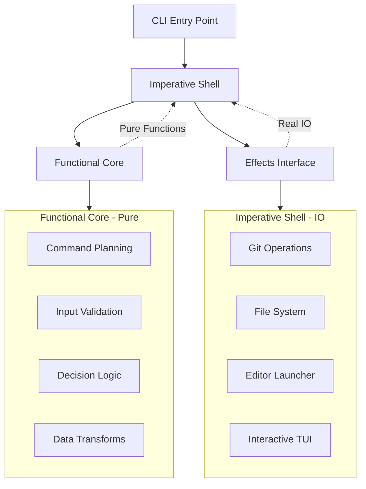

# Functional Programming Refactor Plan

## Architecture Vision



## Phase 1: Foundation - Extract Pure Functions (Week 1)

### Step 1.1: Create test infrastructure ✅

- ✅ Created [`internal/core/core_test.go`](internal/core/core_test.go) with basic test setup
- ✅ Using `testify/assert` (industry standard, not custom helpers)
- ✅ Added factory helpers: `MakeBranch`, `MakeWorktree`
- ✅ Tests passing: `go test ./internal/core/...`

**Decisions made:**

- Switched from custom helpers to `testify/assert` for better standardization
- Kept only factory functions, removed 70+ lines of custom assertion code

### Step 1.2: Extract git command building logic ✅

- ✅ Created [`internal/core/git_commands.go`](internal/core/git_commands.go)
- ✅ Extracted `WorktreeAddArgs` as pure function (from [`cmd/add.go`](cmd/add.go) lines 203-239)
- ✅ Wrote 8 comprehensive test cases covering all branch scenarios
- ✅ Updated [`cmd/add.go`](cmd/add.go) to use the pure function
- ✅ Tests passing, code compiles

**Decisions made:**

- ~~Used placeholder `<path>` in function for better testability~~
- ~~Caller replaces placeholder with actual path (keeps function pure)~~
- Path is now a regular parameter (still pure, no magic needed)
- Reduced add.go from 37 lines of logic to ~15 lines using the pure function
- Named function `WorktreeAddArgs` (not `BuildWorktreeAddCommand`) - shorter, more idiomatic
- Kept return type as `[]string` rather than custom type - more idiomatic Go
- Fixed `--no-track` semantics: only for truly new branches, NOT for remote tracking branches
- Remote branches now correctly enable upstream tracking (critical for `git push`)
- Fixed `--no-track` placement: must come AFTER `-b` (Git parsing requirement)
- Explicit `HEAD` argument for consistency
- Added remote prefix stripping in command handler (`origin/feature` → `feature`)
- Tests now verify argument ordering, not just presence (catches Git CLI bugs)
- Added `t.Parallel()` for faster test execution

**Key learnings:**

- Pure functions are easier to test, but domain knowledge (Git semantics) is still critical
- Code review caught bugs that tests alone wouldn't reveal (argument ordering)
- FP doesn't mean fewer parameters - it means deterministic behavior
- Go prefers concise doc comments over structured JavaDoc-style
- Guard clauses (early returns) are more readable than nested if/else

### Step 1.3: Extract branch filtering logic ✅

- ✅ Created [`internal/core/branches.go`](internal/core/branches.go) with `GetWorktreeAvailableBranches`
- ✅ Extracted filtering logic from [`cmd/add.go`](cmd/add.go) lines 100-127
- ✅ Wrote 7 comprehensive test cases in [`internal/core/branches_test.go`](internal/core/branches_test.go)
- ✅ Updated [`cmd/add.go`](cmd/add.go) to use pure function
- ✅ Tests passing, code compiles

**Decisions made:**

- Named function `GetWorktreeAvailableBranches` (not `FilterAvailableBranches`) - clear domain context
- Function takes `worktrees []git.Worktree` directly (not pre-built map) - better encapsulation
- Added canonical `Branch.Name` field for robust comparison with `Worktree.Branch`
- Fixed upstream bug: filter "origin" remote name in `git.ListAllBranches()` where parsing happens
- Used `map[string]struct{}` for set (idiomatic Go, not `map[string]bool`)
- Preallocated slices for performance
- Added defensive empty name check
- Documented detached HEAD policy (non-obvious business rule)

**Key learnings:**

- Fix data quality issues upstream (in parser), not downstream (in business logic)
- Canonical fields (`Name`) prevent string formatting fragility
- "Available" is vague - `GetWorktreeAvailableBranches` is clear
- Code reviews caught: separation of concerns issue, comparison key fragility, over-commenting
- Iterative refinement through code review improved from 44 lines to 28 lines of clean code

### Step 1.4: Extract worktree selection logic ✅

- ✅ Created [`internal/core/worktrees.go`](internal/core/worktrees.go) with `FilterSproutWorktrees`, `FindWorktreeByBranch`, and `IsPathUnderAnySproutRoot`
- ✅ Extracted filtering logic from [`cmd/open.go`](cmd/open.go), [`cmd/list.go`](cmd/list.go), and [`cmd/remove.go`](cmd/remove.go)
- ✅ Wrote 32 comprehensive test cases in [`internal/core/worktrees_test.go`](internal/core/worktrees_test.go)
- ✅ Updated [`cmd/open.go`](cmd/open.go), [`cmd/list.go`](cmd/list.go), and [`cmd/remove.go`](cmd/remove.go) to use pure functions
- ✅ Deleted obsolete [`cmd/worktrees.go`](cmd/worktrees.go) (all functions migrated)
- ✅ Tests passing, code compiles, no linter errors

**Decisions made:**

- Named `FilterSproutWorktrees` (not `FilterSproutWorktreesAllRoots`) - simpler, takes roots as parameter
- Named `FindWorktreeByBranch` - clear intent, returns `(path, found)` tuple
- Added `IsPathUnderAnySproutRoot` for validation logic in remove command
- All functions take `sproutRoots []string` as parameter for better testability
- Kept `isUnderSproutRoot` as internal helper (not exported)
- Returns `nil` for empty inputs (Go convention for empty results)
- Skips worktrees with empty paths defensively
- Preallocated result slices for performance
- Added parallel test execution with `t.Parallel()`

**Key learnings:**

- Passing dependencies as parameters (sproutRoots) makes functions more testable
- No need to call `sprout.GetAllPossibleSproutRoots()` inside pure functions - caller provides it
- Empty slice vs nil slice matters in Go assertions - be consistent
- Defensive checks (empty path, empty branch) prevent edge case bugs
- Helper function `isUnderSproutRoot` encapsulates filepath comparison logic cleanly
- Refactoring reveals opportunities for complete file deletion (old worktrees.go)

## Phase 2: Core Types - Define FP Infrastructure (Week 2)

### Step 2.1: Create Action types ✅

- ✅ Created [`internal/core/actions.go`](internal/core/actions.go) with core FP types
- ✅ Defined `ActionType` enum with 9 action types
- ✅ Created `Action` struct with flexible `Data map[string]any`
- ✅ Created `Plan` struct to hold action sequences
- ✅ Renamed `CheckTrust` to `TrustRepo` for clarity (trust is an action, not just a check)
- ✅ No linter errors, code compiles

**Decisions made:**

- Used `any` instead of `interface{}` (Go 1.18+ idiom)
- Kept `Data` as flexible map - avoids premature type proliferation
- Named `TrustRepo` not `CheckTrust` - actions modify state, checks don't
- Minimal implementation as specified - expand as needed

**Original plan reference:**

- Create [`internal/core/actions.go`](internal/core/actions.go):

  ```go
                                  type ActionType int
                                  const (
                                      NoOp ActionType = iota
                                      PrintMessage
                                      PrintError
                                      CreateDirectory
                                      RunGitCommand
                                      OpenEditor
                                      RunHooks
                                      CheckTrust
                                      SelectInteractive
                                  )

                                  type Action struct {
                                      Type ActionType
                                      Data map[string]any // Use any for flexibility
                                  }

                                  type Plan struct {
                                      Actions []Action
                                  }
  ```

- Keep it minimal - we'll expand as needed

### Step 2.2: Create Effects interface ✅

- ✅ Created [`internal/effects/effects.go`](internal/effects/effects.go)
- ✅ Defined Effects interface with all side effect operations
- ✅ 7 categories: Git, FS, Config, Trust, Editor, Output, Interactive
- ✅ Fixed type safety: replaced `SelectOne(any, any)` with specific `SelectBranch`/`SelectWorktree` methods
- ✅ Renamed `CreateDir` → `MkdirAll` for clear "ensure exists" semantics
- ✅ Code compiles, no linter errors

**Decisions made:**

- Used specific selection methods (`SelectBranch`, `SelectWorktree`) instead of generics - Go doesn't allow generic interface methods
- Renamed to `MkdirAll` to match `os.MkdirAll` semantics (create parent dirs, idempotent)
- Kept single interface (not split) - will refactor if pain emerges (YAGNI)
- `FileExists` returns bool - CLI semantic: inaccessible = doesn't exist
- `IsTrusted` (check) vs `TrustRepo` (action) clearly separated

**Code review insights:**

- Type safety matters: `any` parameters cause runtime panics
- Name things honestly: `MkdirAll` vs `CreateDir` clarifies intent
- Don't split interfaces prematurely - test mocks can use anonymous structs
- Go limitation: no generic interface methods (only generic types)

**Original plan reference:**

- Create [`internal/effects/effects.go`](internal/effects/effects.go):

  ```go
                                  type Effects interface {
                                      // Git operations
                                      GetRepoRoot() (string, error)
                                      GetMainWorktreePath() (string, error)
                                      ListWorktrees(repoRoot string) ([]git.Worktree, error)
                                      ListBranches(repoRoot string) ([]git.Branch, error)
                                      RunGitCommand(dir string, args ...string) (string, error)

                                      // File system
                                      FileExists(path string) bool
                                      CreateDir(path string, perm os.FileMode) error

                                      // Config
                                      LoadConfig(currentPath, mainPath string) (*config.Config, error)

                                      // Trust
                                      IsTrusted(repoRoot string) (bool, error)
                                      TrustRepo(repoRoot string) error

                                      // Editor
                                      OpenEditor(path string) error

                                      // Output
                                      Print(msg string)
                                      PrintErr(msg string)

                                      // Interactive (kept at edge)
                                      SelectOne(items any, displayFunc any) (int, error)
                                  }
  ```

### Step 2.3: Implement RealEffects ✅

- ✅ Created [`internal/effects/real.go`](internal/effects/real.go)
- ✅ Implemented all Effects methods by delegating to existing packages:
- Git: `git.GetRepoRoot()`, `git.ListWorktrees()`, `git.ListAllBranches()`, `git.RunGitCommand()`
- Config: `config.Load()`
- Trust: `trust.IsRepoTrusted()`, `trust.TrustRepo()`
- Editor: `editor.Open()`
- TUI: `tui.SelectOne()` (wrapped for both `SelectBranch` and `SelectWorktree`)
- FS: `os.Stat()`, `os.MkdirAll()`
- Output: `fmt.Println()`, `fmt.Fprintln(os.Stderr)`
- ✅ Created `NewRealEffects()` constructor
- ✅ Extracted label functions for testability
- ✅ No linter errors, code compiles

**Decisions made:**

- Wrapper is thin - just delegates to existing code (no logic changes)
- `FileExists` uses `!os.IsNotExist(err)` - correctly distinguishes "doesn't exist" from other errors
- Extracted `branchLabel` and `worktreeLabel` as package-level functions for consistency and testability
- Branch selection shows `DisplayName` (remote branches without "origin/" prefix)
- Worktree selection shows branch name, falls back to path for detached HEAD
- Removed verbose doc comments on trivial delegating methods (kept only where behavior needs clarification)
- `NewRealEffects()` constructor kept for future extensibility (e.g., writer injection)
- All methods maintain existing error semantics

**Code review feedback applied:**

- Fixed `FileExists` to properly handle permission errors vs non-existence
- Extracted label functions from inline closures for better testability
- Reduced doc comment noise on simple delegation methods
- Clarified that `ListBranches` → `git.ListAllBranches` returns both local+remote (intentional)

### Step 2.4: Implement TestEffects ✅

- ✅ Created [`internal/effects/testeffects.go`](internal/effects/testeffects.go)
- ✅ Created mock implementation that stores calls and returns predefined values
- ✅ Created [`internal/effects/testeffects_test.go`](internal/effects/testeffects_test.go) with usage examples
- ✅ All 4 test cases passing

**Implementation details:**

- `TestEffects` struct tracks:
- **Predefined values**: `RepoRoot`, `Worktrees`, `Branches`, `Config`, `TrustedRepos`, `Files`, `GitCommandOutput`
- **Structured counters**: `GetRepoRootCalls`, `RunGitCommandCalls`, etc. (one per method)
- **Captured side effects**: `PrintedMsgs`, `PrintedErrs`, `GitCommands` (with `GitCmd{Dir, Args}`), `OpenedPaths`, `CreatedDirs`, `TrustedRepos_Calls`
- **Interactive results**: `SelectedBranchIndex`, `SelectedWorktreeIndex`, `SelectionError`
- `NewTestEffects()` constructor provides sensible defaults (empty slices/maps, `/test/repo` root)
- `GitCmd` struct records both directory and args for git commands

**Decisions made:**

- **Structured tracking, not strings**: Use integer counters (`GetRepoRootCalls`) instead of `Calls []string` with parsing
- **GitCommand key includes directory**: `dir + "\n" + args` prevents bugs when same command runs in different dirs
- `MkdirAll` automatically marks directory as existing in `Files` map (realistic behavior)
- `TrustRepo` updates `TrustedRepos` map so subsequent `IsTrusted` calls work correctly
- Selection methods validate bounds including negative indices (prevent test bugs)
- Empty `RepoRoot` triggers error in `GetRepoRoot` (simulates "not a git repo")
- All methods have zero side effects on real filesystem/git - pure in-memory mocking
- Named `testeffects.go` (not `test.go`) - more idiomatic Go convention

**Code review feedback applied:**

1. ✅ Eliminated "stringly typed" call tracking - use structured counters instead
2. ✅ Fixed `RunGitCommand` key to include `dir` - prevents same-args-different-dirs bug
3. ✅ Renamed file to `testeffects.go` - clearer than `test.go`
4. ✅ Added negative index validation in selection methods
5. ✅ Created `GitCmd` struct for better command recording (not just `[]string`)
6. ✅ Renamed `TrustedRepos_Calls` → `TrustRepoRepos` (more idiomatic Go)
7. ✅ Added argument capture for methods: `ListWorktreesArgs`, `ListBranchesArgs`, `LoadConfigCurrentArgs`, `LoadConfigMainArgs`, `IsTrustedArgs`
8. ✅ Fixed slice aliasing bug in `RunGitCommand` - copies `args` to prevent mutations

**Test coverage:**

- ✅ Basic method calls and structured counter assertions
- ✅ Git command recording with directory tracking
- ✅ State mutations (TrustRepo → IsTrusted flow)
- ✅ Selection validation (negative and out-of-bounds indices)

## Phase 3: First Command Refactor - trust (Week 2)

### Step 3.1: Create trust command planner ✅

- ✅ Created [`internal/core/trust.go`](internal/core/trust.go) with `TrustContext` and `PlanTrustCommand`
- ✅ Created [`internal/core/trust_test.go`](internal/core/trust_test.go) with tests for both scenarios
- ✅ Tests passing: `go test ./internal/core/...`
- ✅ No linter errors

**Implementation details:**

- `TrustContext` contains `RepoRoot` and `AlreadyTrusted` fields
- `PlanTrustCommand` returns a plan with `PrintMessage` if already trusted
- If not trusted, returns plan with `TrustRepo` action followed by success message
- Two test cases: "already trusted" and "not yet trusted"
- Tests verify correct action types and data payloads

**Decisions made:**

- Message "Repository already trusted" (not "Already trusted") for clarity
- Message "Repository trusted" (not "Repository marked as trusted") for conciseness
- Used `TrustRepo` action type (matches `actions.go` enum)
- **REFACTORED**: After code review feedback, converted from `map[string]any` to typed sum types
- Refactored `actions.go` to use interface-based sum types for compile-time safety
- Added input validation: empty `RepoRoot` returns `PrintError` action
- Added constants for all messages: `msgRepoAlreadyTrusted`, `msgRepoTrusted`, `errNoRepoRoot`
- Tests now use type assertions (`action.(PrintMessage)`) instead of map lookups
- Added third test case: "empty repo root returns error"

**Code review improvements applied:**

1. ✅ Replaced `map[string]any` with typed action structs (eliminates runtime typos like `Data["mgs"]`)
2. ✅ Each action type is now a struct implementing `Action` interface
3. ✅ Executor will use type switches instead of `ActionType` enum (cleaner, type-safe)
4. ✅ Added input validation for empty `RepoRoot`
5. ✅ Extracted message constants for consistency and testing
6. ✅ Tests verify exact types, not just `Data` map contents
7. ✅ Added `Exit{Code int}` action for explicit failure handling
8. ✅ Error plan now includes both `PrintError` + `Exit{Code: 1}` for clear semantics

**Final action types in `actions.go`:**

- `NoOp`, `PrintMessage`, `PrintError`, `CreateDirectory`, `RunGitCommand`
- `OpenEditor`, `RunHooks`, `TrustRepo`, `SelectInteractive`, `Exit`

**Benefits:**

- Compiler enforces correctness: `action.Msg` typos = compile errors
- Tests can assert exit codes explicitly: `Exit{Code: 1}` in plan
- Refactor-safe: rename `Msg` → `Message` shows all usages
- IDE autocomplete works perfectly
- No runtime panics from map key typos or type assertions

### Step 3.2: Create plan executor

- Create [`internal/effects/executor.go`](internal/effects/executor.go):

  ```go
                                  func ExecutePlan(plan Plan, fx Effects) error {
                                      for _, action := range plan.Actions {
                                          if err := executeAction(action, fx); err != nil {
                                              return err
                                          }
                                      }
                                      return nil
                                  }

                                  func executeAction(action Action, fx Effects) error {
                                      switch action.Type {
                                      case PrintMessage:
                                          fx.Print(action.Data["msg"].(string))
                                      case RunGitCommand:
                                          _, err := fx.RunGitCommand(action.Data["dir"].(string), action.Data["args"].([]string)...)
                                          return err
                                      // ... etc
                                      }
                                      return nil
                                  }
  ```

### Step 3.3: Refactor trust command

- Update [`cmd/trust.go`](cmd/trust.go) to use new pattern:

1. Create Effects instance
2. Gather inputs using Effects
3. Call PlanTrustCommand
4. Execute plan

- Keep it working exactly as before, just with new structure

### Step 3.4: Add trust command tests

- Create [`cmd/trust_test.go`](cmd/trust_test.go)
- Test with TestEffects - no real filesystem needed
- Verify plan generation is correct
- Verify execution calls right Effects methods

## Phase 4: Second Command - add (Week 3)

### Step 4.1: Create add command planner

- Create [`internal/core/add.go`](internal/core/add.go):

  ```go
                                  type AddContext struct {
                                      Branch string
                                      RepoRoot string
                                      MainWorktreePath string
                                      WorktreePath string
                                      WorktreeExists bool
                                      LocalBranchExists bool
                                      RemoteBranchExists bool
                                      Config *config.Config
                                      IsTrusted bool
                                      NoHooks bool
                                      NoOpen bool
                                  }

                                  func PlanAddCommand(ctx AddContext) (Plan, error) {
                                      // Validation
                                      if err := sprout.ValidateBranchName(ctx.Branch); err != nil {
                                          return Plan{}, err
                                      }

                                      // If exists, just open
                                      if ctx.WorktreeExists {
                                          return Plan{Actions: []Action{
                                              {Type: OpenEditor, Data: map[string]any{"path": ctx.WorktreePath}},
                                          }}, nil
                                      }

                                      // Check trust requirements
                                      if ctx.Config.HasCreateHooks() && !ctx.NoHooks && !ctx.IsTrusted {
                                          return Plan{Actions: []Action{
                                              {Type: PrintError, Data: map[string]any{"msg": "Repository not trusted"}},
                                          }}, fmt.Errorf("untrusted")
                                      }

                                      // Build action sequence
                                      actions := []Action{
                                          {Type: CreateDirectory, Data: map[string]any{
                                              "path": filepath.Dir(ctx.WorktreePath),
                                              "perm": 0755,
                                          }},
                                          {Type: RunGitCommand, Data: map[string]any{
                                              "dir": ctx.RepoRoot,
                                              "args": core.BuildWorktreeAddCommand(ctx.Branch, ctx.LocalBranchExists,
                                                                                     ctx.RemoteBranchExists, true),
                                          }},
                                      }

                                      // Hooks and editor logic
                                      shouldRunHooks := ctx.Config.HasCreateHooks() && !ctx.NoHooks
                                      if shouldRunHooks {
                                          actions = append(actions,
                                              Action{Type: OpenEditor, Data: map[string]any{"path": ctx.WorktreePath}},
                                              Action{Type: RunHooks, Data: map[string]any{
                                                  "type": "on_create",
                                                  "commands": ctx.Config.Hooks.OnCreate,
                                                  "path": ctx.WorktreePath,
                                              }},
                                          )
                                      } else if !ctx.NoOpen {
                                          actions = append(actions,
                                              Action{Type: OpenEditor, Data: map[string]any{"path": ctx.WorktreePath}},
                                          )
                                      }

                                      return Plan{Actions: actions}, nil
                                  }
  ```

### Step 4.2: Write comprehensive add tests

- Create [`internal/core/add_test.go`](internal/core/add_test.go)
- Test all scenarios:
- Worktree exists
- New branch with hooks + trusted
- New branch with hooks + untrusted
- New branch without hooks
- Local branch exists
- Remote branch exists
- With --no-hooks flag
- With --no-open flag
- All tests are pure - no I/O

### Step 4.3: Refactor add command handler

- Update [`cmd/add.go`](cmd/add.go):

1. Create RealEffects instance
2. Gather all inputs (interactive selection stays here)
3. Build AddContext
4. Call PlanAddCommand
5. Execute plan

- Should be much shorter (target: 80-100 lines vs current 282)

### Step 4.4: Add integration test

- Create [`cmd/add_test.go`](cmd/add_test.go)
- Use TestEffects to verify full flow without real git

## Phase 5: Remaining Commands (Week 4-5)

### Step 5.1: Refactor open command

- Create [`internal/core/open.go`](internal/core/open.go) with `PlanOpenCommand`
- Create [`internal/core/open_test.go`](internal/core/open_test.go)
- Update [`cmd/open.go`](cmd/open.go) to use new pattern
- Test scenarios: path arg, branch arg, interactive, with/without hooks

### Step 5.2: Refactor remove command

- Create [`internal/core/remove.go`](internal/core/remove.go) with `PlanRemoveCommand`
- Add safety validation logic as pure function
- Update [`cmd/remove.go`](cmd/remove.go)
- Test edge cases: non-sprout paths, main worktree, etc.

### Step 5.3: Refactor list command

- This is trickier due to parallel status collection
- Create [`internal/core/list.go`](internal/core/list.go):
- Pure: `FormatWorktreeList`, `BuildStatusEmojis`, `ShortenPath`
- Planning: `PlanListCommand` returns what to query
- Keep parallel execution in imperative shell
- Update [`cmd/list.go`](cmd/list.go)

### Step 5.4: Refactor repair and hooks commands

- Create [`internal/core/repair.go`](internal/core/repair.go)
- Create [`internal/core/hooks_display.go`](internal/core/hooks_display.go)
- Update [`cmd/repair.go`](cmd/repair.go) and [`cmd/hooks.go`](cmd/hooks.go)
- These are simpler, should be straightforward

## Phase 6: Polish and Documentation (Week 5)

### Step 6.1: Add dry-run support

- Add `--dry-run` flag to commands
- In handlers, if dry-run: print plan instead of executing
- Demonstrates power of plan-based architecture

### Step 6.2: Improve error handling

- Create [`internal/core/result.go`](internal/core/result.go):

  ```go
                                  type Result[T any] struct {
                                      Value T
                                      Error error
                                  }
  ```

- Update planning functions to use Result where it clarifies code

### Step 6.3: Documentation

- Add [`docs/ARCHITECTURE.md`](docs/ARCHITECTURE.md) explaining FP approach
- Document the Effects interface
- Add examples of testing pure functions
- Update main README with testing notes

### Step 6.4: Final cleanup

- Remove any unused code from old implementation
- Ensure all tests pass
- Run linter and fix issues
- Benchmark critical paths to ensure no performance regression

## Success Metrics

After completion:

- Test coverage should be 70%+ (currently ~5%)
